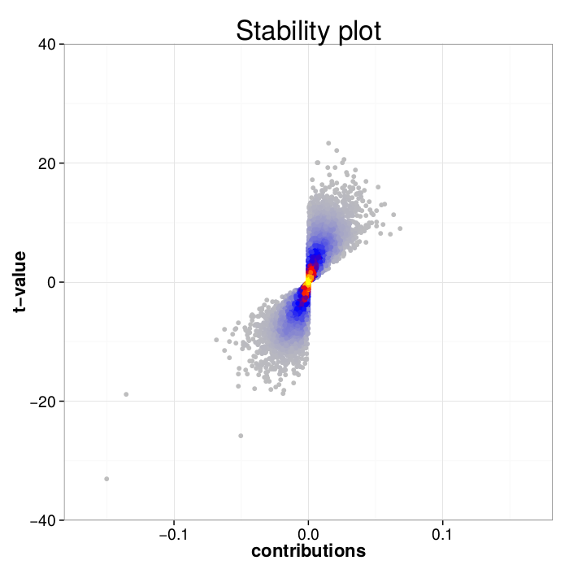
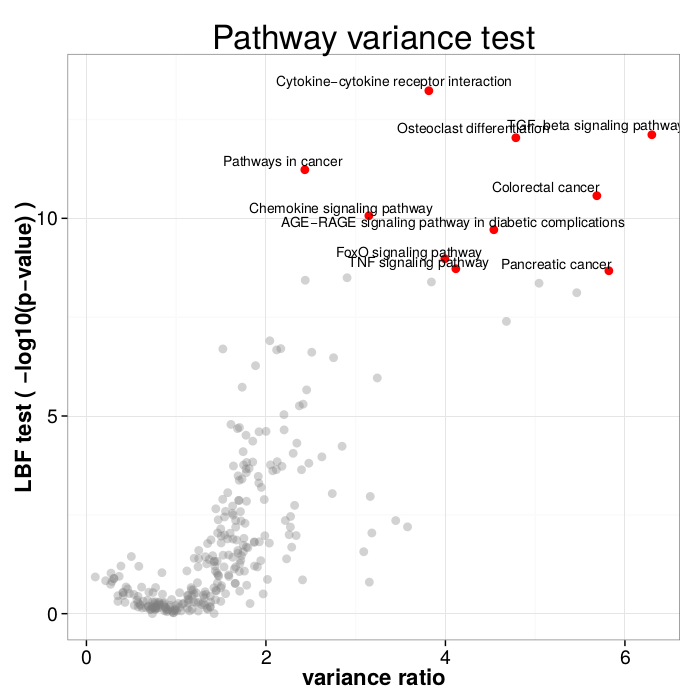
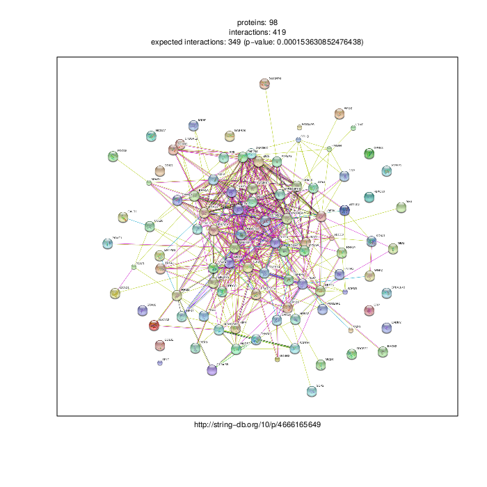

# PheLiM package
### (March 2016)


**PheLiM** (**Phe**notypic **Li**near **M**odel) integrates predictions of off- and on-target siRNA-induced down-regulation to infer gene-specific contributions to phenotypes that are measured in RNA interference screens.
The inference of phenotype-critical genes from siRNA-based screens is challenging, due to pervasive off-target effects of siRNAs. Combining state-of-the-art off-target predictions with predictions of relative on-target efficacy of siRNAs, PheLiM estimates quantitatively the contribution of individual genes to the phenotypes measured through siRNA screening.

##### Required R and Bioconductor Packages (tested versions are specified in parentheses):
 - download and install R (tested on R 3.2.1 and R 3.2.5.) from https://cran.r-project.org/
 - start R and install the following packages
   - randomization packages 

        bigmemory (>= 4.4.6)

        foreach (>= 1.4.3)

        doParallel (>= 1.0.10)

   - regresssion packages

        MASS (>= 7.3-45)

        pls (>= 2.5-0)

   - analysis packages

        ggplot2 (>= 1.0.0)

        lawstat (>= 3.0)

```
install.packages(c("bigmemory", "foreach", "doParallel", "MASS","pls", "ggplot2", "lawstat"))
```

 - install Bioconductor

```
source("https://bioconductor.org/biocLite.R")
biocLite()
```

   - install analysis packages

        KEGGREST (>= 1.8.1)

        STRINGdb (>= 1.8.1)

```
biocLite(c("KEGGREST", "STRINGdb"))
```


#### How to install PheLiM?

Clone the package from the git repository
```
git clone https://github.com/andreariba/PheLiM
```
Enter the PheLiM folder, open the R shell and type:
```
install.packages("PheLiM_1.0.tar.gz", repos = NULL, type="source")
```

#### How to run PheLiM?

The PheLiM kernel is based on R package and the inputs are generated with hybrid scripts, check the related directories.

##### Required input files (example files at www.clipz.unibas.ch/PheLiM/):

 - *phenotypes*: phenotypic measurement corresponding to each siRNA transfection, format:

| siRNA | phen |
|-------|------|
| siRNA1| phen1|
| siRNA2| phen2|
|  ...  | ...  |

 - *clusters*: clusters of siRNAs with related seed sequences, format:

|ID11|ID12|...|

|ID21|ID22|...|

These should be generated with the code provided in 'cluster' folder

 - *intmatrix*: matrix with the predicted down-regulation of each gene in response to each siRNA, format:

|       | geneA | geneB |
|-------|-------|-------|
|siRNAA |scoreAA|scoreAB|
|siRNAB |scoreBA|scoreBB|
|...    |  ...  | ...   |

This should be generated with the code from 'interactionmatrix' folder

 - *expression file* (optional): list of expressed transcripts, format:

geneA

geneB

...

 - *ncores*: number of cores to use (each randomization will run on a different core)
 - *nfit*: number of randomizations (recommended at least 30)

In order to generate all the inputs, the following set of fasta files will be necessary at different steps:

 - siRNA sequences
 - UTR sequences
 - ORF sequences
 - mRNA sequences

Since the programs are time consuming, it is more recommended to select mRNA/ORF/UTR sequences for the most "relevant" transcripts/genes (e.g. for each gene the "representative", or most highly expressed transcript).

Important: for the matrix of predicted down-regulation three different scripts need to be run, one to predict on-target down-regulation, another to predict the off-target down-regulation and the third to create the matrix of combined on/off target down-regulation predictions.

PheLiM( ... ) is the main function, reads the inputs and returns a list containing two matrices (data.frame), the first with the models (gene contributions to phenotype) inferred from each of the partitions of the siRNA set, the other with the average model.

	output <- PheLiM(phenotypes, clusters, intmatrix, expressed="noexpression", ncores=1, nfit=30)

Further, three methods have been implemented for the analysis of gene contributions:

 - **stabilityplot**(contributions):
to assess if largest contributions are significantly different from 0;

 - **variancetest**(contributions):
to identify important pathways affecting the studied phenotype. It requires gene identifiers as Entrez Gene IDs;

 - **STRINGtop**(contributions, ntop, type=c("inhibitors","enhancers","top")):
to get the STRING graph of protein-protein interactions and determine close partners among the top absolute/negative/positive gene contributions (*type* option). *ntop* is the number of genes to be included.

#### Computational requirements

|        | siRNAs| genes |threads|  RAM  |  CPU  |
|--------|-------|-------|-------|-------|-------|
|Myeloma | 13000 | 9000  |   5   |  50G  | 30 m  |
|TGF-beta| 19000 | 9000  |   5   |  60G  | 40 m  |
|InfectX | 90000 | 11000 |   1   |  55G  | 7h 30m|


#### Datasets

We analyzed a series of published screens, check example input at www.clipz.unibas.ch/PheLiM.

1. *Tiedmann et al., Cancer Res., 2012*. Screen perfomed with custom siRNA library (~12000) to discover gene involved in viability of Myeloma cell line.
2. *Schultz et al., Silence, 2011*. Screen perfomed with custom siRNA library (~18000) to investigate SMAD2 translocation phenotype.

## Example
The following code is an example of R script to run PheLiM library.

### step-by-step script

Load the library
```
	library(PheLiM)
```
Select the phenotype-associated file, tab delimited file with siRNA ids and phenotypes ('phenotype' folder)
```
	phenotypefile="phenotype file"
```
Select the file containing siRNA clusters, look at the examples into 'cluster' folder
```
	sirnaclustersfile="sirna cluster file"
```	
Select the text file containing the list of expressed gene identifiers, the ID has to be the same as in the interaction matrix. The best solution is to run the off- and on-target predictions on the subset of expressed transcripts/genes to save running time and set this option to "noexpression".
```
	expressionfile="expressed gene file" (or by default "noexpression")
```
Select the matrix of siRNA-target predictions, look at how to generate it into 'interactionmatrix' folder
```
	interactionfile="interaction matrix file"
```
*Only for parallel running! You can check the number of available cores with*
```
	detectCores(logical = TRUE)
```
*(BE CAREFUL!!! the RAM usage increases linearly with the number of cores) and set the number of cores*
```
	ncores=1
```	
Once all the inputs are generated, you can run PheLiM
```
	outputPheLiM <- PheLiM(phenotypes=phenotypefile,clusters=sirnaclustersfile,intmatrix=interactionfile,expressed=expressionfile, ncores=ncores, nfit=100)
```

The output is a list of two data.frames. The first contains the whole set of models fitted from single partitions of the siRNA set and the latter, the gene contributions associated with each gene, averaged over partitionings
```
	str(outputPheLiM)
	outputPheLiM$rawcontributions #models from each randomization
	outputPheLiM$contributions #processed contributions # <<-- USE THESE
```
Since the memory requirements could be huge, the script should be run on a high-memory machine cluster
```
	write.table(outputPheLiM$contributions,"result.tab", sep="\t", row.names=FALSE)
```

then to continue the analysis in the standard R shell.
Reload and check the stability of the results (gene contributions to the phenotype)

```
	contributions <- read.table("result.tab", header=TRUE)
	stabilityplot(contributions)
```



Further analysis can be perfomed through the variance test and STRING graph.
Variance test requires the conversion of gene identifiers into **Entrez Gene for compatibility with KEGG** (suggested R package for the conversion BiomaRt).
```
	variancetest(contributions)
```



The output is a plot where most significant pathways have been highlighted.

STRING graph enables to visualize the protein-protein interactions in the top contributions (positive, negative or absolute).
```
	STRINGtop(contributions,100)
```


